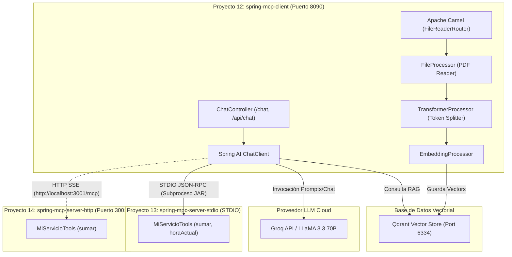

# Guía de Estudio: Proyectos 12, 13 y 14 - Spring AI & Model Context Protocol (MCP)

Esta guía de estudio detalla la arquitectura, funcionamiento, conceptos clave y código de los proyectos **12**, **13** y **14**. Estos proyectos demuestran cómo integrar el protocolo **Model Context Protocol (MCP)** en **Spring Boot** mediante **Spring AI**, combinándolo con capacidades de **RAG (Retrieval-Augmented Generation)**, **Apache Camel** y **Bases de Datos Vectoriales (Qdrant)**.

---

## 📖 1. Introducción al Model Context Protocol (MCP)

### ¿Qué es MCP?
**Model Context Protocol (MCP)** es un estándar abierto desarrollado por Anthropic (e implementado en Spring AI) que permite a los **Modelos de Lenguaje (LLMs)** interactuar de forma segura y estandarizada con herramientas (*Tools*), datos y contexto externo provistos por servidores locales o remotos.

### Componentes de la Arquitectura MCP
1. **Cliente MCP (MCP Client)**: La aplicación (en este caso, [12.spring-mcp-client](file:///home/edlith/Documentos/UCE%2026-26/TALLER%203/taller_3/12.spring-mcp-client)) que inicia las peticiones al LLM y consulta a los Servidores MCP para descubrir y ejecutar herramientas registradas.
2. **Servidor MCP (MCP Server)**: La aplicación que expone herramientas (*Tools*), recursos (*Resources*) o prompts (*Prompts*) específicos que el modelo de IA puede invocar (por ejemplo, [13.spring-mpc-server-stdio](file:///home/edlith/Documentos/UCE%2026-26/TALLER%203/taller_3/13.spring-mpc-server-stdio) y [14.spring-mcp-server-http](file:///home/edlith/Documentos/UCE%2026-26/TALLER%203/taller_3/14.spring-mcp-server-http)).

### Mecanismos de Transporte MCP

| Mecanismo de Transporte | Descripción | Uso Típico |
| :--- | :--- | :--- |
| **STDIO (Standard Input / Output)** | El cliente ejecuta el servidor MCP como un subproceso hijo (comando `java -jar ...` o `npx ...`) y se comunican intercambiando mensajes JSON-RPC por la consola (`stdin`/`stdout`). | Servidores locales autónomos, utilidades de CLI, servidores de archivos locales. |
| **HTTP (Streamable HTTP / SSE)** | El servidor MCP funciona como un servicio web HTTP expuesto en una red (IP:Puerto). La comunicación ocurre mediante HTTP POST y Server-Sent Events (SSE). | Servidores remotos, microservicios distribuidos, arquitecturas multinodo. |

---

## 🏗️ 2. Proyecto 12: `12.spring-mcp-client` (Cliente MCP & RAG)

### Ubicación del proyecto
📁 Path: [12.spring-mcp-client](file:///home/edlith/Documentos/UCE%2026-26/TALLER%203/taller_3/12.spring-mcp-client)

### Descripción General
Es una aplicación **Spring Boot Web** (puerto `8090`) que actúa como **Cliente MCP** y motor **RAG**. Consume las herramientas expuestas por servidores MCP configurados y ofrece endpoints REST para interactuar mediante chat sincrónico o reactivo por streaming.

### Componentes Clave

#### A. Inyección de Herramientas MCP y Configuración de `ChatClient`
- **[ChatController.java](file:///home/edlith/Documentos/UCE%2026-26/TALLER%203/taller_3/12.spring-mcp-client/src/main/java/taller/rest/ChatController.java)**:
  - Inyecta `List<ToolCallbackProvider>` provistos automáticamente por `spring-ai-starter-mcp-client`.
  - Registra las funciones obtenidas en el `ChatClient.Builder` mediante `.defaultTools(...)`.
  - Expone dos endpoints REST:
    1. `POST /chat`: Respuesta completa sincrónica en formato texto.
    2. `POST /api/chat`: Respuesta reactiva vía **Server-Sent Events (SSE)** codificada en Base64 token por token (`Flux<ServerSentEvent<String>>`).

```java
public ChatController(ChatClient.Builder builder, List<ToolCallbackProvider> toolProviders) {
    List<ToolCallback> tools = new ArrayList<>();
    for (ToolCallbackProvider provider : toolProviders) {
        tools.addAll(List.of(provider.getToolCallbacks()));
    }
    chatClient = builder
            .defaultAdvisors(new SimpleLoggerAdvisor())
            .defaultTools(tools.toArray(new Object[0]))
            .build();
}
```

#### B. Pipeline de Ingesta RAG con Apache Camel
- **[FileReaderRouter.java](file:///home/edlith/Documentos/UCE%2026-26/TALLER%203/taller_3/12.spring-mcp-client/src/main/java/taller/routers/FileReaderRouter.java)**: Monitorea una carpeta de entrada buscando PDFs mediante el patrón EIP *File Polling*:
  ```
  file:inboundPath?antInclude=*.pdf&delay=1000&move=procesados
    ➡️ fileProcessor (PagePdfDocumentReader)
    ➡️ transformerProcessor (TokenTextSplitter)
    ➡️ embeddingProcessor (VectorStore / Qdrant)
  ```
- **[FileProcessor.java](file:///home/edlith/Documentos/UCE%2026-26/TALLER%203/taller_3/12.spring-mcp-client/src/main/java/taller/services/FileProcessor.java)**: Lee las páginas del archivo PDF con `PagePdfDocumentReader` y las convierte a objetos `Document`.
- **[TransformerProcessor.java](file:///home/edlith/Documentos/UCE%2026-26/TALLER%203/taller_3/12.spring-mcp-client/src/main/java/taller/services/TransformerProcessor.java)**: Subdivide (*chunking*) los documentos extensos en fragmentos más pequeños basados en recuento de tokens utilizando `TokenTextSplitter`.
- **[EmbeddingProcessor.java](file:///home/edlith/Documentos/UCE%2026-26/TALLER%203/taller_3/12.spring-mcp-client/src/main/java/taller/services/EmbeddingProcessor.java)**: Recibe los chunks y los persiste en la base de datos vectorial **Qdrant**.

#### C. Búsqueda Vectorial Standalone
- **[ConsultaDbVectorialMain.java](file:///home/edlith/Documentos/UCE%2026-26/TALLER%203/taller_3/12.spring-mcp-client/src/main/java/taller/ejemplos/ConsultaDbVectorialMain.java)**: Ejemplo independiente de generación de embeddings usando el modelo ONNX local y ejecución de consultas por similitud K-NN con `QdrantGrpcClient` en el puerto `6334`.

#### D. Configuración de Servidores MCP (`mcp-server.json`)
El archivo [mcp-server.json](file:///home/edlith/Documentos/UCE%2026-26/TALLER%203/taller_3/12.spring-mcp-client/src/main/resources/mcp-server.json) declara los servidores MCP STDIO a lanzar:
```json
{
  "mcpServers": {
    "filesystem": {
      "command": "npx",
      "args": ["mcp-server-filesystem", "/home/edlith/tools/distribuida2626"]
    },
    "mi_mpc_server": {
      "command": "java",
      "args": ["-jar", "/path/to/13.spring-mpc-server-stdio.jar"]
    }
  }
}
```

---

## 🖥️ 3. Proyecto 13: `13.spring-mpc-server-stdio` (Servidor MCP STDIO)

### Ubicación del proyecto
📁 Path: [13.spring-mpc-server-stdio](file:///home/edlith/Documentos/UCE%2026-26/TALLER%203/taller_3/13.spring-mpc-server-stdio)

### Descripción General
Servidor MCP que se ejecuta en segundo plano sin servidor web Tomcat (`web-application-type: none`). Se comunica de forma transparente mediante la entrada/salida estándar (`stdin`/`stdout`).

### Componentes Clave

#### A. Definición de Herramientas MCP
- **[MiServicioTools.java](file:///home/edlith/Documentos/UCE%2026-26/TALLER%203/taller_3/13.spring-mpc-server-stdio/src/main/java/org/example/MiServicioTools.java)**: Define métodos anotados con `@McpTool` que quedan expuestos al Cliente MCP.
  ```java
  @Service
  public class MiServicioTools {
      @McpTool(description = "Add two numeric values")
      public String sumar(@McpToolParam Integer num1, @McpToolParam Integer num2) {
          return String.valueOf(num1 + num2);
      }

      @McpTool(description = "Obtiene la hora Acutal")
      public String horaActual() {
          return LocalDate.now().toString();
      }
  }
  ```

#### B. Evitación de Ruido en STDOUT ([application.yml](file:///home/edlith/Documentos/UCE%2026-26/TALLER%203/taller_3/13.spring-mpc-server-stdio/src/main/resources/application.yml))
En transporte STDIO, **cualquier impresión suelta en consola corrompe el canal JSON-RPC**. Por este motivo:
- `spring.main.web-application-type: none` (sin Tomcat).
- `spring.main.banner-mode: off` (desactiva el banner de Spring).
- `logging.pattern.console: ""` y `logging.file.name: mcp-server.log` (los logs van a un archivo en lugar de STDOUT).

---

## 🌐 4. Proyecto 14: `14.spring-mcp-server-http` (Servidor MCP Streamable HTTP)

### Ubicación del proyecto
📁 Path: [14.spring-mcp-server-http](file:///home/edlith/Documentos/UCE%2026-26/TALLER%203/taller_3/14.spring-mcp-server-http)

### Descripción General
Servidor MCP que expone sus herramientas a través de **HTTP** (Server-Sent Events / Streamable HTTP) escuchando en el puerto `3001` y el endpoint `/mcp`.

### Componentes Clave

#### A. Dependencia WebMVC para MCP
Utiliza la dependencia oficial de Spring AI para servidores web HTTP:
`implementation("org.springframework.ai:spring-ai-starter-mcp-server-webmvc")`

#### B. Configuración HTTP ([application.yml](file:///home/edlith/Documentos/UCE%2026-26/TALLER%203/taller_3/14.spring-mcp-server-http/src/main/resources/application.yml))
```yaml
server:
  port: 3001
spring:
  ai:
    mcp:
      server:
        name: mi-mcp-server
        version: 1.0.0
        protocol: streamable
        streamable-http:
          mcp-endpoint: /mcp
```

#### C. Herramientas Expuestas
- **[MiServicioTools.java](file:///home/edlith/Documentos/UCE%2026-26/TALLER%203/taller_3/14.spring-mcp-server-http/src/main/java/org/example/MiServicioTools.java)**: Expone la herramienta `sumar(num1, num2)` para ser invocada vía HTTP por clientes MCP.

---

## 📊 5. Cuadro Comparativo de los Proyectos

| Característica | Proyecto 12 (`spring-mcp-client`) | Proyecto 13 (`spring-mpc-server-stdio`) | Proyecto 14 (`spring-mcp-server-http`) |
| :--- | :--- | :--- | :--- |
| **Rol en MCP** | Cliente MCP (Consumidor) | Servidor MCP (Proveedor) | Servidor MCP (Proveedor) |
| **Modo de Transporte** | STDIO (Vía subprocesos) | STDIO (`stdin`/`stdout`) | Streamable HTTP (SSE) |
| **Puerto Servidor** | `8090` | Ninguno (`web-application-type: none`) | `3001` |
| **Endpoint Principal** | `/chat`, `/api/chat` | Canal de consola (JSON-RPC) | `/mcp` |
| **Integración RAG** | Sí (Camel + PDF Reader + Qdrant) | No | No |
| **LLM Configurado** | Groq / LLaMA 3.3 70B (vía OpenAI Client) | N/A | N/A |

---

## 📐 6. Diagrama de Arquitectura Integrada



---

## 🛠️ 7. Pasos para Compilar y Ejecutar

### Paso 1: Compilar los Servidores y el Cliente
Desde la raíz del repositorio, ejecuta:
```bash
./gradlew build -x test
```

### Paso 2: Ejecutar el Servidor MCP HTTP (Proyecto 14)
```bash
cd 14.spring-mcp-server-http
../gradlew bootRun
```
*Escuchará en `http://localhost:3001/mcp`.*

### Paso 3: Generar el JAR del Servidor MCP STDIO (Proyecto 13)
Asegúrate de que el JAR `13.spring-mpc-server-stdio.jar` esté generado en `13.spring-mpc-server-stdio/build/libs/` para que Proyecto 12 lo ejecute vía subproceso STDIO.

### Paso 4: Ejecutar el Cliente MCP (Proyecto 12)
```bash
cd 12.spring-mcp-client
export API_KEY="tu_api_key_de_groq"
../gradlew bootRun
```
*Escuchará en `http://localhost:8090`.*

### Paso 5: Probar una petición POST de Chat
```bash
curl -X POST http://localhost:8090/chat \
     -H "Content-Type: application/json" \
     -d '{"message": "Sumar 15 y 30 usando la herramienta disponible"}'
```
El modelo responderá invocando la herramienta `sumar` registrada desde el servidor MCP.
